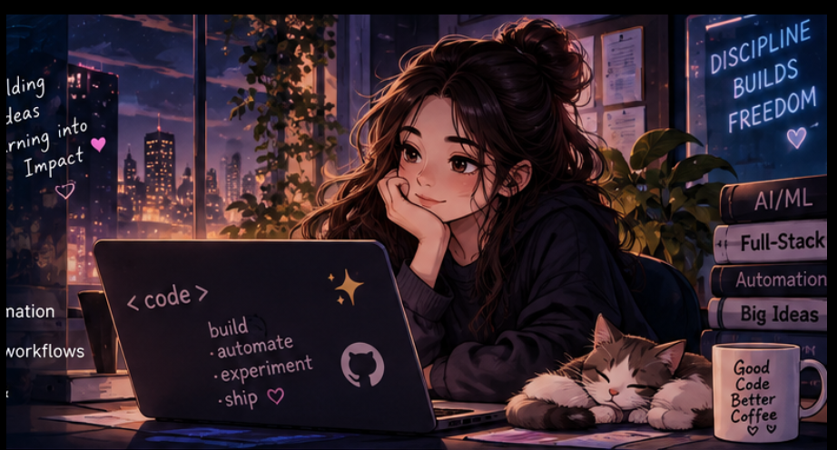

# 💫 About Me:

### 👋 Hey, I'm Isha Rai!

🎓 **Full Stack AI Developer ||Final Year Student|| Galgotias University**  
🤖 **AI/ML • GenAI • LLMs • NLP • AI Agents • Automation**  
💻 **Full-Stack Developer** | MERN • Java • Spring Boot  
📊 Building **data-driven applications, APIs & intelligent workflows**  
🚀 Turning real-world problems into **practical software & AI-powered products**

---

# 💻 Tech Stack:

---

### 🌱 Currently

▸ 🔭 Building AI-powered products, full-stack applications & automation workflows  
▸ 🌱 Exploring GenAI, LLMs, NLP, AI Agents & intelligent automation  
▸ ⚙️ Creating automation workflows that turn repetitive tasks into smart solutions  
▸ 🤝 Open to collaborating on AI/ML, Full-Stack, Backend & Automation projects  

### ✍️  Quote

### 💬 Let's Talk

**AI/ML • Full-Stack Development • AI Agents • Automation • Backend • DSA**

 

✨ **Build • Automate • Experiment • Ship** 🚀

# 📊 GitHub Stats

<table>
<tr>
<td width="50%" align="center">

</td>

<td width="50%" align="center">

</td>
</tr>

<tr>
<td colspan="2" align="center">

</td>
</tr>
</table>

## 🌐 Socials:

<!-- Proudly created with GPRM ( https://gprm.itsvg.in ) -->
